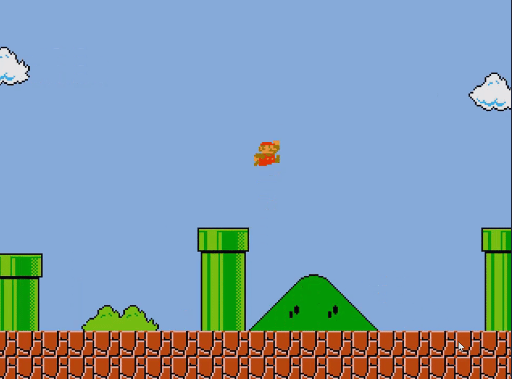

# Simple Game Engine

## Presentation

*For educational purposes*

A project I made a while ago. It's a 2D game engine that uses [SDL2](https://www.libsdl.org) as a base.
As it's name implies, it's a very simple game engine designed for quick prototype building.

The engine's design is heavily inspired from [Unity](https://unity.com/).
Everything is an `Object` that is updated at every frame. The game creator can add `Components` to enrich objects and create his own `ScriptComponents` where their write the logical behaviour of each object.

### Some of the engine's features include:

- 📦 **Dynamic object-component system**: Safely instanciate or destroy objects at any time while playing. Attach or detach components and scripts freely from any object.
- 📝 **Scripts**: Write scripts that can be attached to objects with easy-access to various sub-systems like `Input`, `Camera`, `Object`, `Audio`, etc.
- 🎧 **Audio**: Play music and sounds easily from anywhere. You can choose to use `playSound()` or `playSoundFast()` to load the file in memory or not.
- 👾 **Texture**: Draw your object on screen with `TextureComponent`. The engine handles texture caching so you can have multiple objects with the same texture.
- 🚶‍♂️ **Animated Texture**: Animate objects with the `AnimatedTextureComponent`. It requires an `*.sganim` file that describes where animations start and end on a spritesheet. Once initialized, animating an object is just a matter of calling `playAnimation()`.
- 💿 **Object deserialization**: Construct objects from a `*.sgo` file. Within an SGO file you can specify default data for an object as well as which components it holds when instanciated and their default data. You can also specify children for the object.
- 🌍 **World deserialization**: Similarly to object serialization, you can create `*.sgworld` files which contain data to instanciate and destroy multiple objects quickly.
- 🗺 **Generate level from a [Tiled](https://www.mapeditor.org) JSON file**: Generate a level from JSON data and a tileset contained in an image file.
  You can also create an optional `*.sgmap` file which associates SGO file to a tile index in the JSON. This allows you to place game objects like player or enemy spawns, checkpoints, pick-ups, etc. directly in *Tiled*

## Dependencies

This engine uses [SDL2](https://www.libsdl.org), [SDL_image](https://github.com/libsdl-org/SDL_image), [SDL_ttf](https://github.com/libsdl-org/SDL_ttf) and [SDL_mixer](https://github.com/libsdl-org/SDL_mixer)

## How to build

This git repository contains both the engine's source as well as a project's basic structure.

### Building the engine

Before building the engine you <u>must</u> copy SDL2 headers under `SimpleGameEngine/dependencies/SDL/include` don't forget to put other SDL2 libraries headers like SDL2_image, SDL2_ttf and SDL2_mixer.

the `SimpleGameEngine` folder contains the engine's source and a makefile to build a static library
At the root of this repository you'll find a shell script named `update-engine-deps.sh`. This shell script simply builds the engine and copies all .h files and the generated .a file to the `Game` folder.

This is useful if you want to work on the engine and immediatly test your changes in a project.

### Making a game

#### Pre-requisites
If you just want to build a game you are most likely not interested in fiddling with the engine's source.
The pre-requisites are the following:
- Under `Game/SGE` place the engine's static library in the `lib` folder and the engine's headers in the `include` folder. This GitHub repository has a release which includes the built engine, it's sources and the include files.
- Under `dependencies/SDL` place SDL2 headers, SDL2_image headers, SDL2_ttf headers and SDL2_mixer headers in the `include` folder and SDL2 shared libraries under `lib`

#### Adding assets
Any of your game's assets should be placed under the `resources` folder.
The engine's API is designed so that whenever you have to specify a filepath, it should always be a relative path from the inside of `resources`.

#### Adding scripts
Create a new folder within the `scripts` folder with the name of your script. Place your .cpp and .h files inside that folder

If you want to make use of the deserialization feature with your scripts, you must populate the `std::map` inside `ScriptParsing.cpp`
which is used to associate a script name as a string to a function that adds the script to a target object.

`{"scriptName", SCRIPT_LAMBDA_SIGNATURE{ target->addScript<ScriptName>(); }}`

#### Building the game
Run the python script within the `Build` folder to automatically generate an executable inside `GameOut` (Currently only on MacOS)
Alternativly:
- Running the Makefile inside the `Game` folder produces a shared library
- Running the Makefile inside the `Build`folder produces an executable. You might need to manually create the GameOut folder and place your dylib in it

## Missing documentation

This project was made long ago and lacks documentation.

## TODO
- Add a config file to change the Game's name
- Make the building process cross-platform (only MacOS for now)
- Support Visual Studio .sln format

## Known issues
- When making a .app folder, the game doesn't find the dylib despite rpath being set
- Improve SDL2 linking to make applications portable

## Conclusion

There is a lot to improve and fix on this engine but it fulfills it's main purpose. You can create simple 2D prototypes without having to worry about anything else but your game.

I would not recommend this engine to anyone who wants to make a polished, content-rich and optimized game. There are lots of very powerful free engines with an active community and a documentation, namely [Unity](https://unity.com), [Unreal Engine](https://www.unrealengine.com/en-US/unreal-engine-5), [Godot](https://godotengine.org)
